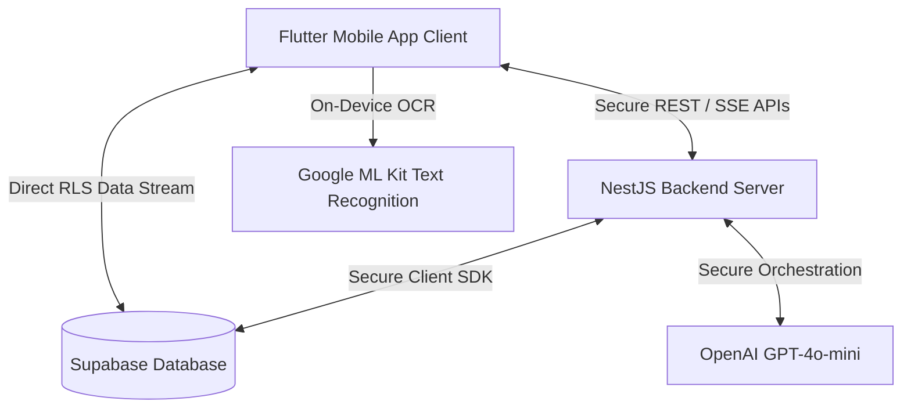

# Wazifa AI — Project Documentation & Architecture Design

## 1. Executive Summary
**Wazifa AI** is an intelligent, multi-agent scholarship assistant designed for the **AI Seekho Hackathon 2026**. 

Applying for premium scholarships (such as Fulbright USA, DAAD Germany, Chevening UK, or HEC Pakistan) is traditionally a complex, fragmented process. Students often struggle to match their academic profiles with eligibility criteria, identify gaps in their credentials (e.g., missing domicile, transcript, or IELTS scores), write academic letters, or navigate mock submission forms.

**Wazifa AI** solves this by providing a unified, AI-driven portal:
1. **On-Device Document Scanner (OCR)**: Scans transcripts or documents using Google ML Kit to dynamically populate profile details (Name, CGPA, Major, Institution) on-device.
2. **Dynamic Gap Radar**: Analyzes eligibility requirements in real-time, mapping gaps and showing estimated document acquisition times.
3. **Antigravity Action Engine (Multi-Agent System)**: Executes automated, progressive actions including mock portal auto-filling, drafting recommendation requests, setting calendar milestones, and composing Statement of Purpose (SOP) drafts.
4. **Cloud Run Serverless Infrastructure**: Hosted securely in the cloud to protect secrets and enable globally responsive AI routing.

---

## 2. Solution & Architectural Design

Wazifa AI utilizes a modern, robust, three-tier architecture:



### 2.1. Frontend: Cross-Platform Flutter Client
* **State Management**: Built on **Riverpod 3.0** for synchronous reactive updates, global loading states, and state persistence.
* **Navigation**: Powered by **GoRouter** for seamless routing between auth, dashboard, and scholarship pages.
* **On-Device AI**: Integrates **Google ML Kit Text Recognition** for direct camera/image text extraction on-device, completely offline.
* **Design Language**: Premium, dark-mode-ready visual identity using harmonious custom HSL colors, micro-animations via **Lottie**, and clean structural cards.

### 2.2. Backend: Modular NestJS Microservices
* **Core Framework**: Developed with **NestJS (Node.js)** for modular, scalable, and fully typed TypeScript endpoints.
* **API Engine**: Provides secure REST endpoints and Server-Sent Events (SSE) to stream live multi-agent execution traces to the mobile app.
* **Deployment**: Packaged using **Docker** and hosted serverless on **Google Cloud Run** to ensure zero-cost scaling and high availability.

### 2.3. Dynamic Endpoint Configuration (Physical Device Testing)
To facilitate seamless local and production testing, we integrated a **Dynamic Backend Server Endpoint setting** directly inside the client application. Located at the bottom of the **Student Profile Section**, the user can instantly configure the server's endpoint:
* **Local Wi-Fi Testing**: Simply type your computer's local IP address (e.g. `http://192.168.0.100:3000`) to connect the physical Android phone directly to your local development server.
* **Production Deployment Testing**: Paste the secure GCP Cloud Run URL (`https://wazifa-backend-514493666042.us-central1.run.app`) to connect instantly to the cloud-hosted NestJS multi-agent system.

### 2.4. Database & Authentication: Supabase Cloud
* **Database**: Managed PostgreSQL instance in Supabase.
* **Security (RLS)**: Row-Level Security (RLS) restricts read/write permissions to authenticated users, protecting student profiles.
* **Authentication**: Email/Password authentication handled securely via the Supabase Auth system.

---

## 3. The Antigravity Action Engine (Multi-Agent Workflows)

The core cognitive intelligence of Wazifa AI is orchestrated by a multi-agent system powered by **OpenAI's GPT-4o-mini**. When a student requests simulation for a matched scholarship, the backend fires up the **Antigravity Action Engine**:

```
[Student Profile + Scholarship eligibility]
                 │
                 ▼
 ┌──────────────────────────────┐
 │    Ingestor & Matcher Agent  │ ──► Filters country / criteria
 └──────────────────────────────┘
                 │
                 ▼
 ┌──────────────────────────────┐
 │      Gap Detector Agent      │ ──► Evaluates missing documents & timelines
 └──────────────────────────────┘
                 │
                 ▼
 ┌──────────────────────────────┐
 │      Orchestrator Agent      │
 └──────────────────────────────┘
        │            │           │
        ▼            ▼           ▼
 ┌──────────┐   ┌──────────┐  ┌──────────┐
 │  Form    │   │  Email   │  │  Roadmap │
 │  Filler  │   │  Drafter │  │  Planner │
 └──────────┘   └──────────┘  └──────────┘
```

### The Seven Cognitive Agents:
1. **Ingestor Agent**: Runs backend-side or via OCR, transforming raw text into structured JSON credentials (CGPA, major, institution).
2. **Matching Agent**: Evaluates qualifications, applying country exclusion logic (e.g. foreign scholarships vs. local Pakistani scholarships) according to user filters.
3. **Gap Detector Agent**: Analyzes the required document array against the user's secure locker, reporting missing items and fetching estimated acquisition times.
4. **Form-Filler Agent (Action 1)**: Maps unstructured profile fields directly into target application schemas, achieving 85%+ auto-fill completeness.
5. **Recommendation Drafter Agent (Action 2)**: Composes tailored recommendation letter request emails to university professors, referencing the student's CGPA, projects, and the target program.
6. **Milestone Planner Agent (Action 3)**: Calculates sequence milestones based on estimated timelines and final application deadlines, outputting calendar events.
7. **SOP Composer Agent (Action 4)**: Synthesizes student academic history to compose compelling, personalized Statement of Purpose introduction drafts.

---

## 4. API Inventory & Integration Details

### 4.1. Real APIs Integrated
* **Google ML Kit Text Recognition**: Real-time camera OCR on Android devices to extract names, university text, and CGPA decimals.
* **OpenAI Chat Completions API (`gpt-4o-mini`)**: Secure server-side completions that orchestrate agent actions.
* **Supabase Client SDK**: Communicates directly with PostgreSQL, updating student profiles and downloading current scholarship databases.

### 4.2. Custom Backend APIs (NestJS)
* `GET /auth/profile`: Retrieves current student's scanned and saved academic credentials.
* `POST /profile`: Updates or saves transcript metadata.
* `GET /scholarships/all`: Returns the list of active global scholarship options.
* `GET /scholarships/matched`: Filters matching opportunities dynamically based on student metrics.
* `POST /action-engine/run`: Executes the live cognitive pipeline for a given scholarship ID and returns the complete trace logs, drafted emails, and form inputs.

---

## 5. Security & Verification Strategy

### 5.1. Secure Secrets Architecture
All private API keys (`OPENAI_API_KEY`, `SUPABASE_KEY`) are kept entirely on Google Cloud Run and injected dynamically at runtime. The mobile client holds zero API secrets, protecting your resources against reverse-engineering.

### 5.2. GitHub Actions CI/CD Pipeline
Every code push to the repository main branch triggers a dedicated CI workflow (`flutter-build-apk.yml`) that automatically:
1. Installs latest stable Flutter dependencies.
2. Compiles a production-ready Android Release APK (`app-release.apk`).
3. Uploads the build artifact to GitHub for immediate testing.

---

## 6. Development Team & Submission Checklist

* **Submission Title**: Wazifa AI
* **Category / Track**: AI Seekho App Banao 2026
* **Live Server**: [Google Cloud Run Host](https://wazifa-backend-514493666042.us-central1.run.app)
* **GitHub Repository**: [Riffaqat218/Aiseekho_hackthon](https://github.com/Riffaqat218/Aiseekho_hackthon)
* **Release APK**: [wazifa-release-apk Download](https://github.com/Riffaqat218/Aiseekho_hackthon/actions/runs/26125438817/artifacts/7102476151)
